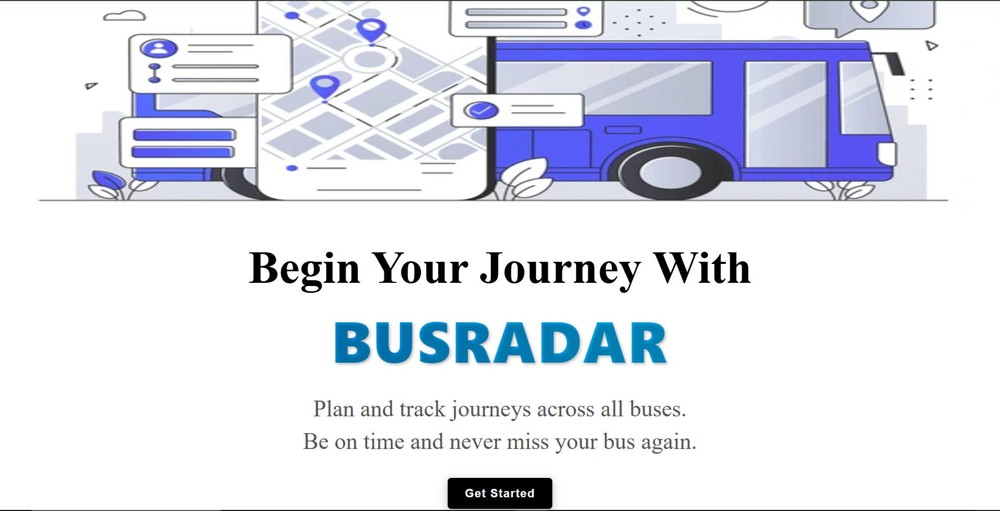
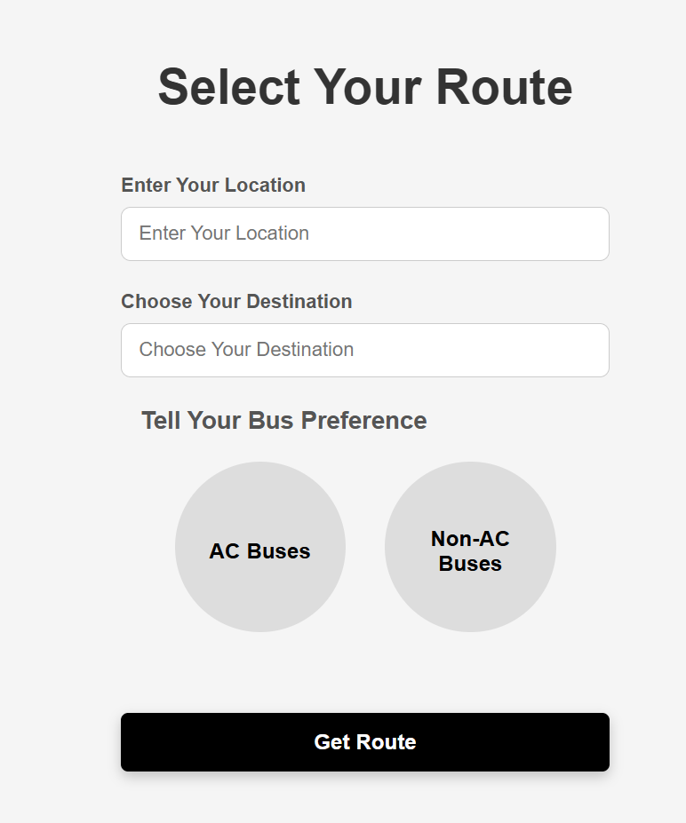

# 🚍 BusRadar

BusRadar is a smart bus route planning and tracking application designed to help users find the best bus routes between locations with an easy-to-use and responsive interface.

The application allows users to:
- Select source and destination
- Filter buses based on AC/Non-AC preference
- Visualize routes on maps
- Track and manage bus journey planning efficiently

---

# 📌 Problem Statement

Public transportation users often face difficulties such as:
- Confusing bus routes
- Lack of route filtering
- Difficulty finding suitable buses
- Poor journey planning experience

BusRadar simplifies this process by providing an interactive and user-friendly route selection system.

---

# ✨ Features

## 🗺️ Route Selection
Users can enter:
- Current location
- Destination

---

## 🚌 Bus Preference Filtering
Supports:
- AC buses
- Non-AC buses

---

## 📍 Route Visualization
- Interactive map integration
- Geospatial route representation
- Better understanding of bus navigation

---

## ⚡ REST API Integration
Built APIs for:
- Route handling
- Bus filtering
- Data processing
- Request management

---

## 📱 Responsive UI
Optimized for:
- Mobile devices
- Tablets
- Desktop screens

---

# 🛠️ Tech Stack

| Technology | Purpose |
|------------|----------|
| React.js | Frontend UI |
| Node.js | Backend Runtime |
| Express.js | API Development |
| MongoDB | Database |
| REST API | Communication |
| CSS | Styling |

---

# 🏗️ System Architecture

Frontend (React)
↓
REST APIs (Express.js)
↓
Node.js Server
↓
MongoDB Database

---

# 📸 Project Screenshots

## 🏠 Landing Page

  

---

## 🛣️ Route Selection

  

👩‍💻 Author

Nishtha